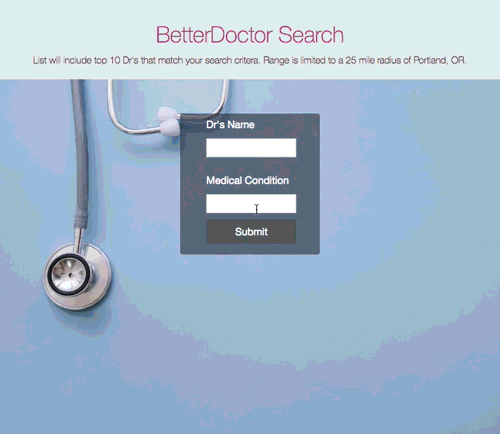

# **Doctor Lookup**
  Powered By: [BetterDoctor](https://developer.betterdoctor.com/)  <br>


#### By Adrian Messado
[Adrian Messado](https://github.com/adrianmess)
## Description
A website where users can enter a medical condition or the name of a Doctor and list of the top 10 Doctors that match the search criteria will be shown. The data returned will contain the name, contact information, business address and a link to their website if one is available.

* Search results are limited to a 25 mile radius of Portland, OR.  

This website utilizes the [BetterDoctor API](https://developer.betterdoctor.com/) for retrieval of provider data.



## Setup/Installation Requirements

#### Prerequisites

-  [NPM 5.0+](https://www.npmjs.com/get-npm)
-  [Git](https://git-scm.com/downloads)
-  [BetterDoctor](https://developer.betterdoctor.com/) API Key

#### Clone
  * Clone this repo to your local machine using https://github.com/adrianmess/doctor-lookup
        $ git clone https://github.com/adrianmess/doctor-lookup


#### BetterDoctor API Key

  After you sign up your API key will be listed on the main developer page under **CREDENTIALS**.
  > Note: API Key can also be found under - My Account > Applications


    CREDENTIALS
    Key: 22065b1d...

  How to use your API Key:
  > Create a .env file in the root directory of the project.
    > Add the API key in the .env file as shown below. No brackets:
    ```
    exports.apiKey=[YOUR-API-KEY]
    ```

#### Build and Install

  > Navigate to the project folder in your terminal then run the following commands.

  * Install:
             $ npm install
  * Run:
             $ npm start


## Specifications

| Specification | Input | Output |
| --- | --- | --- |
| Medical condition entered by user. Matching Doctors  will be returned returned. | Back Pain | List of Dr's in Portland that can treat Back Specification
| Name of Doctor submitted and list of Doctors with that name returned | First-Name, Last-Name or Both | List of Dr's whose name  match search criteria

* Medical condition and Doctors name can both be used to narrow down search.
* If a match is found the following information will be shown.
 *  First Name
 *  Last Name
 *  Address
 *  Phone Number
 *  Website
 *  Whether or not the doctor is accepting new patients
* If the API call results in an error, the application will return a notification that states what the error is.
* If the query response doesn't include any doctors (for instance, if no doctors meet the search criteria), the application should return a notification that states that no doctors meet the criteria.


## Known Bugs
  * No known bugs at this time.


## Technologies Used

* HTML
* CSS
  * Bootstrap _(Bootstrap 4.1)_
* JavaScript
  * JQuery _(jQuery 3.2.1)_
* Node.js
* Webpack
* ESLint
* Jasmine
* Karma
* Babel
* BetterDoctor API


## License

* GPL

Adrian Messado © 2018
